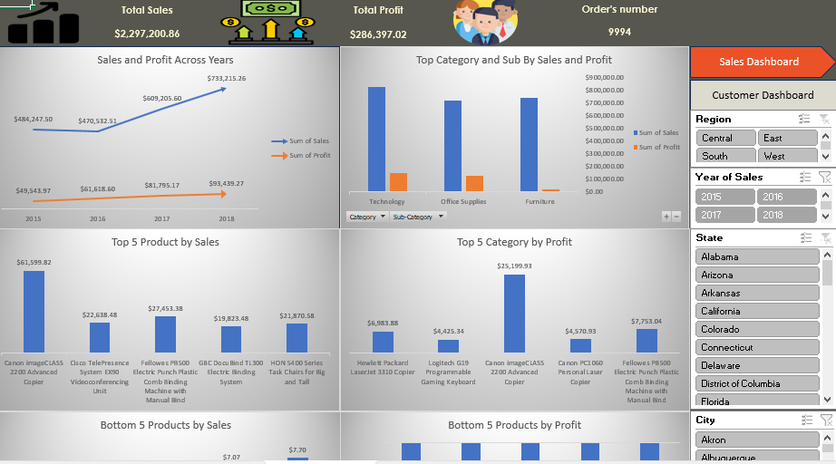
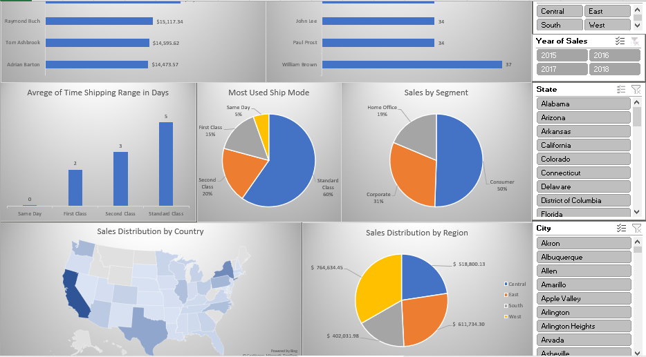

# Sales Analysis Dashboard – Excel + Power Query + Power Pivot

This project showcases a dynamic sales dashboard built using Microsoft Excel. It leverages Power Query for data cleaning and transformation, and Power Pivot for data modeling and DAX calculations.

## 🔧 Tools Used
- Microsoft Excel
- Power Query
- Power Pivot
- DAX

## 📊 Features
- Cleaned and structured sales data
- Monthly and category-level performance analysis
- KPIs and interactive slicers
- Business logic to highlight growth and underperformance

## 📁 Project Goals
- Practice real-world data analysis using Excel BI tools
- Build a reusable dashboard for sales insights
- Apply DAX logic to calculate metrics and trends

## 📷 Dashboard Preview
  

## 🧑‍💻 Author
Mo – Data Analyst | SQL • Power BI • Python (Learning)
